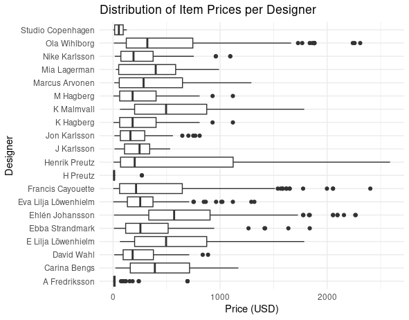
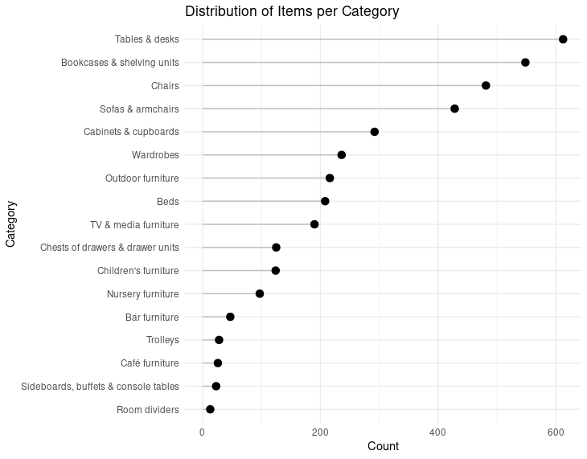
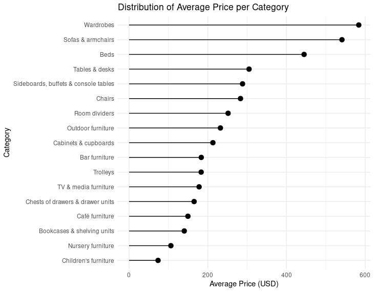

# COMP4010/5120 Data Visualization - Homework 1 Question Set

This assignment dives into the world of data manipulation and visualization using the `tidyverse` package in R. You'll work with [an IKEA furniture dataset]((https://github.com/rfordatascience/tidytuesday/blob/master/data/2020/2020-11-03/)), exploring various techniques to clean, transform, and visually represent the data.

Throughout the assignment, you'll encounter ten tasks, each requiring you to write R code to achieve specific data manipulation and visualization goals. 

Feel free to experiment, explore different approaches, and consult online resources if needed. Remember to utilize clear and concise code with meaningful variable names and comments to enhance readability and understanding.

Dataset: The dataset, [`ikea_data.csv`](https://github.com/rfordatascience/tidytuesday/blob/master/data/2020/2020-11-03/), contains information about various IKEA furniture items, including their names, categories, prices, dimensions, and designers.

### Data dictionary

|variable          |class     |description |
|:-----------------|:---------|:-----------|
|item_id           |double    | Item ID (Irrelevant to us) |
|name              |character | Commercial name of items |
|category          |character | The furniture category |
|price             |double    | Current price in Saudi Riyals |
|old_price         |character | Price of item in Saudi Riyals before discount |
|sellable_online   |logical   | Sellable online (boolean) |
|link              |character | Link to the item |
|other_colors      |character | Whether other colors are available for the item (boolean) |
|short_description |character | Description of the item |
|designer          |character | Designer who designed the item |
|depth             |double    | Depth of the item in Centimeter |
|height            |double    | Height of the item in Centimeter |
|width             |double    | Width of the item in Centimeter|

# Submission requirements
Similar to the weekly AEs, you should submit your work in 2 formats: `Rmd` and `pdf` to Canvas.
Answers for non-coding questions should be added in the file as plain text.

## Task 1: Converting prices to USD

Convert the price column from Saudi Riyals (SAR) to USD, considering an exchange rate of 1 SAR = 0.27 USD. Create a new column, `price_usd`, containing the prices in USD.

# Task 2: Splitting multiple designers into seperate rows

The designer column might contain multiple designers separated by "`/`". Split these entries into separate rows, creating a new data frame with one designer per row. 

For example, consider the following example dataframe `df`:
| item_id          |designer     |price |
|:-----------------|:---------|:-----------|
|1| Designer A | 1      
|2| Designer B/Designer C/Designer D | 15   

Item 2 has 3 designers, we need to create a new dataframe `df_split` by splitting the designer column:
|item_id          |designer     |price |
|:-----------------|:---------|:-----------|
|1| Designer A | 1   |   
|2| Designer B | 15   |  
|2| Designer C     | 15    | 
|2| Designer D    | 15   |

Hint: There are multiple ways to achieve this, but you can check out the [documentation for `seperate_rows`](https://tidyr.tidyverse.org/reference/separate_rows.html) if you need help.

# Task 3: Get top 20 designers by number of items. Exclude NA and IKEA of Sweden.

Based on `df_split` in Task 2, find the top 20 designers with the most products (excluding "`IKEA of Sweden`" and entries with missing values in the `designer` column) and store it in a new dataframe called `top_designers`. The dataframe should have 2 columns which show the designer name and the corresponding number of item made by that designer:

| designer | num_items|
|:-----------------|:---------|
| Designer Z | 74 |
| Designer X | 107 |
| Designer Y | 67 |
| ... | ... |

Hint: You may find the following functions useful: 
- [`filter()`](https://www.rdocumentation.org/packages/dplyr/versions/0.7.8/topics/filter)
- [`is.na()`](https://www.statology.org/is-na/)
- [`group_by()`](https://datacarpentry.org/R-genomics/04-dplyr.html#split-apply-combine_data_analysis_and_the_summarize()_function)
- [`summarize()`](https://datacarpentry.org/R-genomics/04-dplyr.html#split-apply-combine_data_analysis_and_the_summarize()_function)
- [`n()`](https://www.statology.org/n-function-in-r/)
- [`top_n()`](https://www.rdocumentation.org/packages/dplyr/versions/0.7.8/topics/top_n)

In your RMarkdown, answer the following question(s):
- Who are the top 3 designers by number of items?
- What is the number of items designed by IKEA of Sweden or by unknown designers? Why should we exclude them from the analysis?

# Task 4. Visualizing price distribution per designer with box plot
Create a boxplot to visualize the distribution of item prices (USD) for each designer identified in `top_designers`. Your plot should show x-axis for designers and y-axis for prices.
Add appropriate axis labels, and a plot title.

An example plot (yours may look different):

In your RMarkdown, answer the following question(s):
- In 3-4 sentences, briefly describe the key findings from this plot. (Open ended question - write down anything useful you can see from this plot)
- In your opinion, is this an effective visualization? If not, what is your suggestion to improve it?

# Task 5. Distribution of Items per Category with lollipop chart
In the original dataset, count the number of items in each `category` and visualize the distribution using a lollipop chart (recall Weekly AE 2). Create a bar chart with categories on the x-axis, item count on the y-axis, and informative labels and title. 

**Optional**: Sort the categories in descending order of item count.

An example plot (yours may look different):

In your RMarkdown, answer the following question(s):
- In 3-4 sentences, briefly describe the key findings from this plot. (Open ended question - write down anything useful you can see from this plot)
- In your opinion, is this an effective visualization? If not, what is your suggestion to improve it?

# Task 6. Average price per category with lollipop chart
Calculate the average price (USD) for each category and visualize the distribution using a lollipop chart. 

**Optional**: Sort the categories by average price in descending order.

An example plot (yours may look different):

In your RMarkdown, answer the following question(s):
- In 3-4 sentences, briefly describe the key findings from this plot. (Open ended question - write down anything useful you can see from this plot)
- In your opinion, is this an effective visualization? If not, what is your suggestion to improve it?

# Task 7. Price vs. Volume relationship with scatter plot
A volume of each item is the product of its `height`, `width`, and `depth`. Plot a scattter plot of volume on the y-axis, and the price in USD on the x-axis. Color the plot using `category`.

An example plot (yours may look different):

In your RMarkdown, answer the following question(s):
- In 3-4 sentences, briefly describe the key findings from this plot. (Open ended question - write down anything useful you can see from this plot)
- In your opinion, is this an effective visualization? If not, what is your suggestion to improve it?