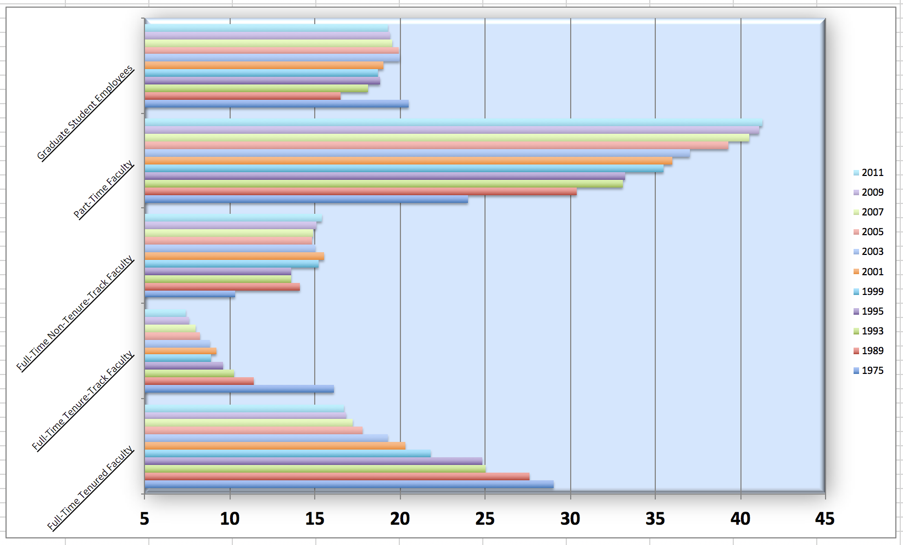

# COMP4010/5120 - Week 6 Application Exercises
---

# A. Application Exercises

**Data:** [`instructional-staff.csv`](instructional-staff.csv)

The American Association of University Professors (AAUP) is a nonprofit membership association of faculty and other academic professionals. [This report](https://www.aaup.org/sites/default/files/files/AAUP_Report_InstrStaff-75-11_apr2013.pdf) by the AAUP shows trends in instructional staff employees between 1975 and 2011, and contains an image very similar to the one given below.

Each row in this dataset represents a faculty type, and the columns are the years for which we have data. The values are percentage of hires of that type of faculty for each year.

In order to recreate this visualization we need to first reshape the data to have one variable for faculty type and one variable for year. In other words, we will convert the data from the long format to wide format.

## Task 1. Recreate the visualization

Reshape the data so we have one row per faculty type and year, and the percentage of hires as a single column.

## Task 2. Attempt to recreate the original bar chart as best as you can. 

Don’t worry about theming or color palettes right now. The most important aspects to incorporate:

- Faculty type on the y-axis with bar segments color-coded based on the year of the survey
- Percentage of instructional staff employees on the x-axis
- Begin the x-axis at 5%
- Label the x-axis at 5% increments
- Match the order of the legend

> [forcats](https://forcats.tidyverse.org/) contains many functions for defining and adjusting the order of levels for factor variables. Factors are often used to enforce specific ordering of categorical variables in charts.

## Task 3. Let’s make it better

The original plot is not very informative. It’s hard to compare the trends for across each faculty type.

Improve the chart by using a relative frequency bar chart with year on the y-axis and faculty type encoded using color.

What are this chart’s advantages and disadvantages? 

## Task 4: Let’s instead use a line chart. 

Graph the data with year on the x-axis and percentage of employees on the y-axis. Distinguish each faculty type using an appropriate aesthetic mapping.

## Task 5: Cleaning it up

- Add a proper title and labelling to the chart
- Use an optimized color palette
- Order the legend values by the final value of the percentage variable

## Task 6: More improvements!

Colleges and universities have come to rely more heavily on non-tenure track faculty members over time, in particular part-time faculty (e.g. contingent faculty, adjuncts). We want to show how academia is increasingly relying on part-time faculty.

With your peers, sketch/design a chart that highlights the trend for part-time faculty. What type of geom would you use? What elements would you include? What would you remove?

Create the chart you designed above using `ggplot2`.

